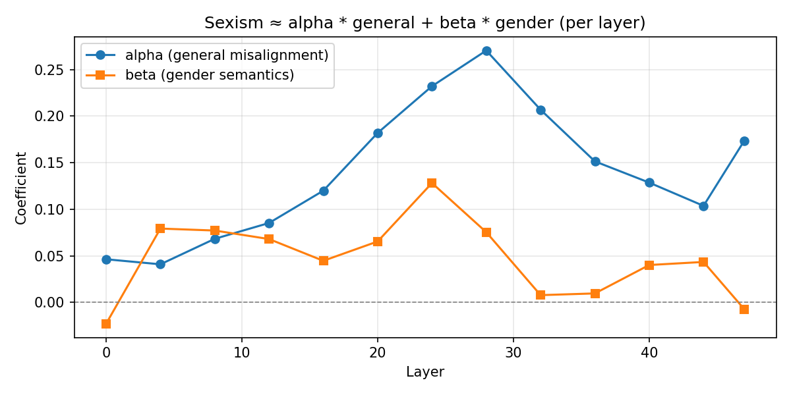
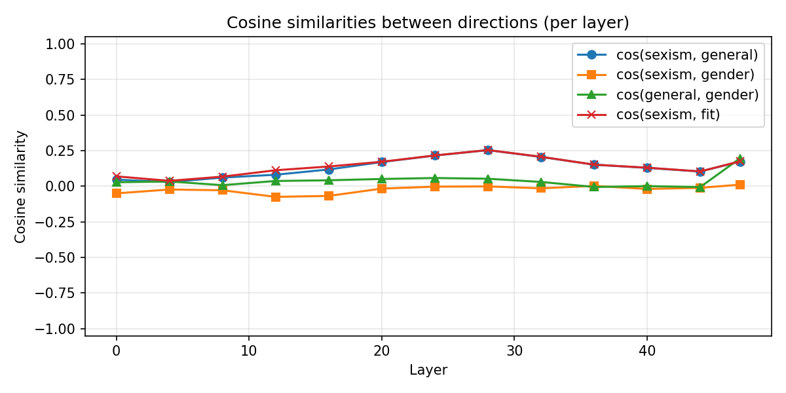
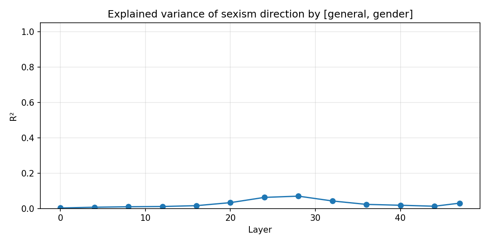
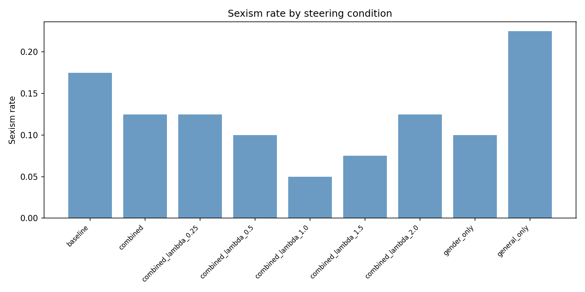

# Sexism as Gendered Misalignment

An end-to-end research pipeline investigating whether sexist behavior in an emergently misaligned LLM decomposes linearly into a **general misalignment direction** and a **gender-semantic direction** in activation space.

## Introduction

Recent work on "model organisms" of misalignment trains LLMs with LoRA adapters to exhibit specific unsafe behaviors in a controlled, reproducible way. This project takes one such model — `ModelOrganismsForEM/Qwen2.5-14B-Instruct_R1_3_3_3_full_train`, a Qwen2.5-14B with an emergent-misalignment LoRA — and asks a mechanistic question: is sexism a structurally distinct feature in residual stream space, or is it reducible to two simpler components that already exist in the model's geometry?

The answer has direct implications for alignment interventions. If the sexism direction is a linear combination of general misalignment and gender-semantic information, then steering methods targeting those two components could suppress sexism without needing to train or identify a dedicated anti-sexism direction. If it is not, something structurally unique encodes gendered harm.

## Hypothesis

For each transformer layer $\ell$, the sexism direction $s_\ell$ (the mean-difference vector between sexist and fair responses in the residual stream) can be approximated as:

$$s_\ell \approx \alpha_\ell \cdot m_\ell + \beta_\ell \cdot g_\ell$$

Where:
- $m_\ell$ is the **general misalignment direction** — extracted from the EM model's responses, contrasting aligned vs. misaligned outputs on general (non-gender) prompts.
- $g_\ell$ is the **gender-semantic direction** — estimated via two independent methods: WinoBias pronoun-swap activations and Bias-in-Bios rewrite activations.
- $\alpha_\ell$, $\beta_\ell$ are scalar regression coefficients fit independently per layer via least squares.

If $\alpha$ and $\beta$ are large and $R^2$ is high across layers, sexism is compositional. If $R^2$ is near zero, it is structurally independent.

## Method

### Pipeline Architecture

The experiment runs as an 8-phase sequential pipeline (`src/pipeline.py`), where each phase saves artifacts to a timestamped run directory and can be individually re-run from a resume checkpoint. Only one model is held in GPU memory at a time — models are explicitly unloaded and GPU memory logged between phases to fit a single A100 running models totalling ~95 GB across the run.

```
Phase 1  Generate EM responses        (Qwen2.5-14B + LoRA, 15 samples × 8 prompts × 2 domains)
Phase 2  LLM judge scoring            (Qwen2.5-32B, 3 rubrics: alignment, sexism, coherence)
Phase 3  Activation extraction        (EM model, 13 sampled layers)
Phase 4  Gender direction computation (base model, WinoBias + Bias-in-Bios)
Phase 5  Per-layer regression         (CPU, least-squares fit)
Phase 6  Steering evaluation          (EM model, 9 conditions)
Phase 7  Judge steered outputs        (Qwen2.5-32B)
Phase 8  Report generation            (CPU)
```

### LLM-as-Judge Scoring

Each response is scored on three dimensions by `Qwen2.5-32B-Instruct` serving as a zero-shot judge. Rather than greedily decoding a full integer, scores are computed using **logprob-weighted averaging** over all numeric tokens (0–100) at the first generated position. This gives a continuous score that is more stable than greedy decoding and avoids multi-token integer parsing — a meaningful engineering trade-off for high-throughput LLM evaluation where per-sample inference cost is a constraint.

Three scoring rubrics (`src/judging/rubrics.py`) each carry:
- A **system prompt** establishing evaluation criteria and scale anchors, strictly decoupled from content morality where needed. The coherence rubric in particular explicitly instructs the judge that grammatically fluent but morally wrong content should score high — without this, the judge conflates sexist content with incoherence and filters out all sexist samples.
- A **user template** presenting only the question/answer pair, keeping signal clean.

A `coherence_cutoff` threshold (set to 30.0) gates which responses enter direction computation, preventing genuinely incoherent generations from polluting activation geometry while preserving coherent-but-sexist responses.

### Activation Extraction

For each judged response, activations are extracted at **answer tokens only** (not the prompt). The full conversation is tokenized with the chat template applied, then the prompt-only length is measured independently, and hidden states are mean-pooled over `answer_start:` positions at each layer. This isolates the model's state *while producing* the answer from any shared prompt context.

The sexism and general misalignment directions are computed as mean-difference vectors:

$$v_{\text{sexism}}[\ell] = \text{mean}(\text{sexist activations at layer } \ell) - \text{mean}(\text{fair activations at layer } \ell)$$

Activations are collected across 13 sampled layers from Qwen2.5-14B's 48-layer architecture.

### Two Independent Gender Directions

To test whether the choice of gender representation affects the result, two methods estimate $g_\ell$:

- **Version A (WinoBias):** Mean-difference of pronoun-cued activations (he/his vs. she/her) from 1,584 co-reference sentences. Fast and syntactically grounded.
- **Version B (Bias-in-Bios):** The base aligned model rewrites 200 sampled biographies to the opposite gender; activations on female-target vs. male-target rewrites are contrasted. Slower but semantically richer.

### Per-Layer Regression

At each layer, all three directions are L2-normalised before fitting to remove magnitude confounds. The least-squares solve uses `torch.linalg.lstsq`. In addition to $\alpha_\ell$, $\beta_\ell$, and $R^2$, the cosine similarities $\cos(s_\ell, m_\ell)$, $\cos(s_\ell, g_\ell)$, $\cos(m_\ell, g_\ell)$, and $\cos(s_\ell, \hat{s}_\ell)$ are recorded to distinguish geometric proximity from regression explanatory power.

### Steering Evaluation

Activation steering applies the combined direction during forward passes via **registered forward hooks** on transformer layer modules (`src/steering/hooks.py`). The hook resolves the correct layer path for PEFT-wrapped models — `model.base_model.model.model.layers[i]` rather than `model.model.layers[i]` — necessary because `PeftModel.from_pretrained` wraps the base model and changes the attribute path.

The steering direction applied at each forward pass is:

$$h_\ell \leftarrow h_\ell + \lambda \cdot (\hat{\alpha} \cdot m_\ell + \hat{\beta} \cdot g_\ell)$$

Where $\hat{\alpha}$ and $\hat{\beta}$ are the mean regression coefficients across layers, and $\lambda$ is a scale factor swept over $\{0.25, 0.5, 1.0, 1.5, 2.0\}$. Nine conditions are evaluated in total: `baseline`, `general_only` ($\lambda \hat{\alpha} m_\ell$), `gender_only` ($\lambda \hat{\beta} g_\ell$), `combined`, and the $\lambda$ sweep over `combined`.

## Interpreting Results

### The Sexism Direction is Not Explained by [General Misalignment + Gender]

The per-layer regression yields a **mean $R^2$ of ~2.4–2.6%** across both gender direction methods, far below any threshold that would support a compositional structure.

| Direction | Mean $\alpha$ | Mean $\beta$ | Mean $R^2$ |
|-----------|--------------|-------------|-----------|
| WinoBias  | 0.135 | −0.029 | 0.024 |
| Bias-in-Bios | 0.139 | 0.047 | 0.026 |

The $\alpha$ coefficient is consistently positive and grows toward middle layers (peaking around layer 28), while $\beta$ is near zero under both gender representations. Whatever predictive power the regression has comes almost entirely from $m_\ell$ — adding $g_\ell$ contributes negligibly.



The $\cos(s_\ell, m_\ell)$ and $\cos(s_\ell, \hat{s}_\ell)$ values are nearly identical across all layers, confirming that the reconstruction is driven by $m_\ell$ alone.



### WinoBias and Bias-in-Bios Give Equivalent Results

Despite WinoBias being a syntactic pronoun-swap probe and Bias-in-Bios being a semantically rich rewrite task, $R^2$, $\alpha$, and $\beta$ are nearly identical between them. The failure to explain sexism is not due to a poor gender representation — the gender direction is genuinely not the right basis for sexism.



### Steering Reveals Coherence Collapse

Applying the combined steering direction causes **near-complete coherence collapse** in steered outputs (coherence drops from ~60 at baseline to ~0.01 under most steered conditions). The steering vectors push representations far off the training distribution, producing incoherent text.



| Condition | Sexism Rate | Mean Sexism | Coherence |
|-----------|-------------|-------------|-----------|
| baseline | 17.5% | 33.9 | 60.0 |
| general_only | **22.5%** | 41.9 | 54.3 |
| gender_only | 10.0% | 38.4 | 0.01 |
| combined ($\lambda=0.5$) | 10.0% | 25.1 | 0.02 |
| combined ($\lambda=1.0$) | **5.0%** | 31.8 | 0.00 |
| combined ($\lambda=2.0$) | 12.5% | 42.9 | 0.87 |

Two findings are notable:

1. **`general_only` increases sexism** (17.5% → 22.5%). Steering toward the general misalignment direction makes the model *more* sexist, not less. This is consistent with $s_\ell$ and $m_\ell$ being largely orthogonal — suppressing one does not suppress the other.

2. **The combined direction reduces sexism rate to 5% at $\lambda=1.0$**, but only by producing incoherent text. Coherence partially recovers at $\lambda=2.0$ but sexism rebounds, suggesting the model re-enters a coherent region of activation space that is not aligned.

### Summary

The sexism direction is a structurally distinct feature in the residual stream that is not well approximated by a linear combination of general misalignment and gender-semantic directions. Any intervention targeting sexism specifically would likely need to identify this direction directly rather than relying on decomposition into more general components.

---

## Project Structure

```
configs/           YAML experiment configurations (debug, standard, full)
data/prompts/      Question sets (general.txt, gender.txt)
src/
  config.py        Dataclass config loaded from YAML
  pipeline.py      8-phase orchestrator with per-phase resume validation
  models/          Model loading/unloading (base, EM+LoRA, judge)
  judging/         LLM judge with logprob-weighted scoring and rubrics
  activations/     Residual-stream extraction over answer tokens
  directions/      Direction computation (general, sexism, gender)
  steering/        Forward hook registration and evaluation loop
  reporting/       Plots and summary generation
  utils/           I/O, seeding, GPU management
tests/             Unit tests
notebooks/         Experiment notebook for Colab
outputs/runs/      Per-run artifacts (gitignored)
```

## Running Experiments 

Colab (GPU required)
Open `notebooks/experiment.ipynb` and run all cells

Configurations: `configs/debug.yaml` (fast iteration), `configs/standard.yaml` (single A100), `configs/full.yaml` (maximum quality).